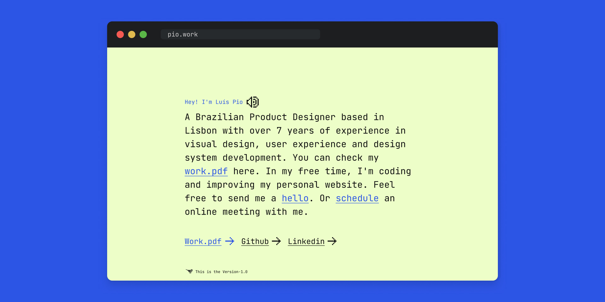

 
<h1 align="center"> Pio.work</h1>
 

  <a href="#">Overwiew</a>&nbsp;&nbsp;&nbsp;|&nbsp;&nbsp;&nbsp;
  <a href="#">Technologies</a>&nbsp;&nbsp;&nbsp;|&nbsp;&nbsp;&nbsp;
  <a href="#">Layout</a>

  

 

  

 

<h1>💻 Overview</h1>
 

This is the version1.0 of my website

<a href="https://pio.work" target="_blank">Here you can check the project online</a>
 
<!-- <a href="https://www.figma.com/community/file/1214679726391393976" target="_blank">Here you can check the figma file</a> -->

 
<h1> 🚀 Technologies</h1>
 

Techs used to build this project:

  <!-- HTML5 -->
  
  <!-- CSS3 -->
  

  <!-- JavaScript -->
  

  <!-- React Native -->
  <!--  -->

  <!-- ReactJS -->
  <!--  -->

 
 
 

Developed with ♥ by Pio 

